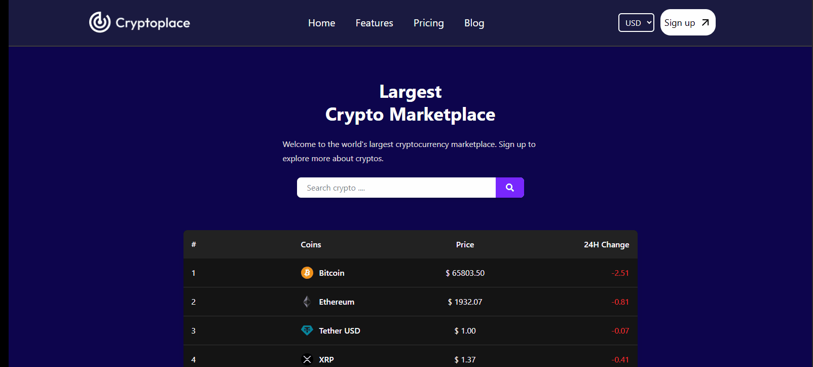

# 💰 Crypto Info App

This repository contains a real-time cryptocurrency information application built using **React** and **Vite**. The project fetches live data of hundreds of cryptocurrencies through API requests, and presents detailed insights including graphical analysis in both USD and EUR.

---

## 🚀 Features
- Live cryptocurrency price tracking via API  
- Support for hundreds of coins  
- Filter/search coins in real-time  
- View coin values in both USD and EUR  
- Detailed coin pages with dynamic charts  
- Chart updates automatically based on selected currency  
- Fully responsive UI with **Tailwind CSS**  
- Smooth client-side navigation with **React Router**  

---

## 🛠️ Technologies Used

### 💻 Frontend
- React  
- Vite  
- Tailwind CSS  
- @tailwindcss/vite  
- React Icons  
- React Router DOM  
- Axios  
- React Google Charts  

### 📈 Charting
- Coin detail pages feature dynamic data visualization using **react-google-charts**  

---

## 📺 Demo

